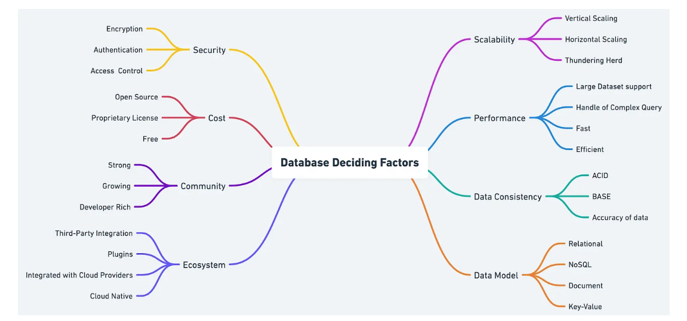
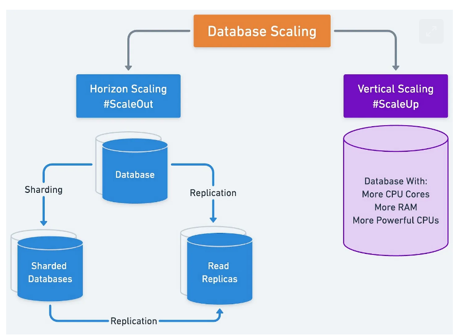
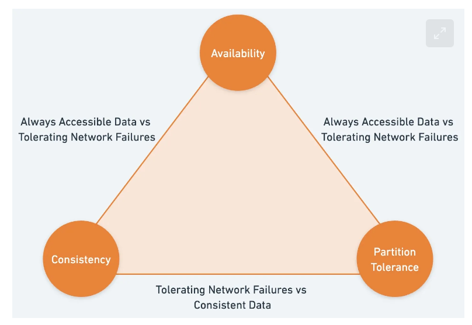
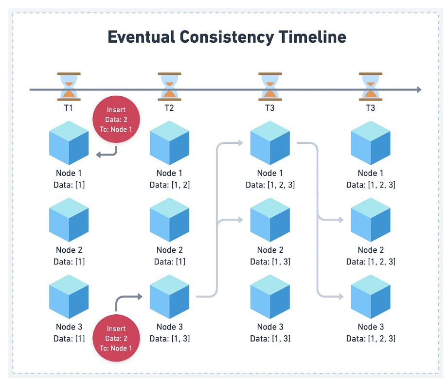
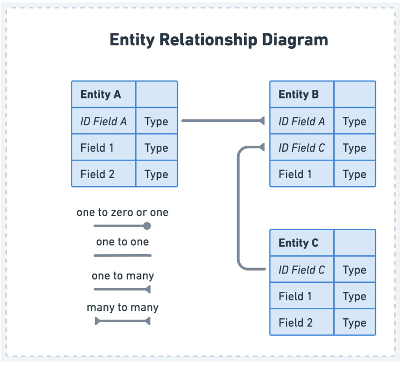
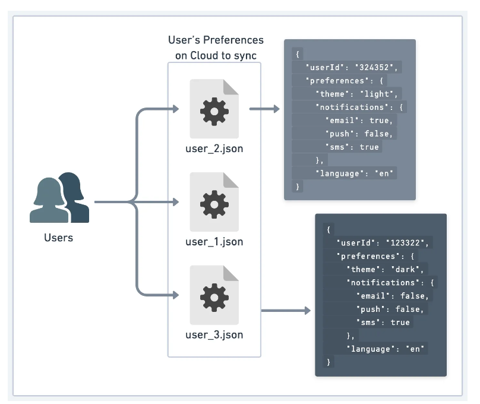
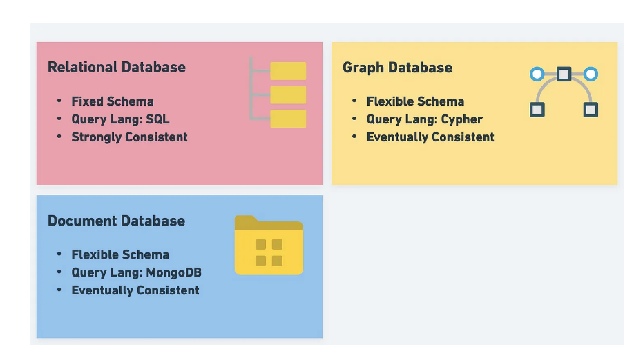

# Factors to Consider in Database Selection

- https://blog.bytebytego.com/p/factors-to-consider-in-database-selection

## Scalability

- Determines how well the system can accommodate growth
- Two primary methods exist:
  - Vertical
  - Horizontal

- Relational databases can struggle with horizontal scaling while NoSQL databases excel here
- **When selecting a database, consider the expected growth of the project and how well the 
  database can handle such expansion**

-----------------

- Relational databases store data in tables with a predefined schema, and they may struggle to 
  scale horizontally due to the need to maintain consistency across multiple servers
  - Can lead to performance bottlenecks
- NoSQL databases were designed with scalability in mind
  - Employ various strategies like sharding and partitioning to distribute data across multiple 
    servers
  - More efficient horizontal scaling and can better handle growing data volumes and traffic loads
- NewSQL
  - Aims to offer best of both worlds but is new

## Performance

- Query efficiency and the balance between read and write performance should be considered
- Some databases may be optimized for read-heavy workloads while others may write performance

-----------------

- Relational databases usually provide efficient querying capabilities due to structured schema 
  and SQL support
  - Performance is optimized for complex queries involving joins and aggregations
  - As data volume and complexity increases, query performance can degrade, especially with large 
    dataset
- NoSQL databases can offer faster write speeds due to simpler data models and more flexible schemas
  - Useful where data is constantly generated and updated like streaming applications or 
    real-time analytics
  - Not as efficient when it comes to complex queries or aggregations, lack same level of 
    support for SQL and structured schema

## Data Consistency

- Data consistency ensures that the info in the database remains accurate and up-to-date
- To achieve consistency, databases rely on ACID properties and CAP theorem
  - ACID = Atomic, Consistent, Isolated, and Durable
  - CAP = Consistency, Availability, and Partition Tolerance
- Relational databases emphasize strong consistency
  - Ensures that every transaction maintains the integrity of the data
- CAP theorem

- A better mental model to follow when evaluating a database is `PACELC`
  - If a system is partition tolerant, it must choose between Availability and Consistency 
    during a network partition and between Latency and Consistency when the network is operating 
    normally
  - Highlights trade-offs that databases must make when it comes consistency

-------------------

- NoSQL leans toward eventual consistency
- Updates to the data will eventually propagate across all nodes in the system, but may not be 
  immediately visible
  - Allows for higher availability and better performance in distributed systems, but can result 
    in temporary inconsistencies between nodes

## Data Model

- Data model defines how data is structured, stored, and queried
- Factors such as schema flexibility and support for complex data relationships should be taken 
  into account when evaluating a database's data model

-----------------

- Relational databases use a fixed schema
- Enforces a consistent structure across all records
- Beneficial for ensuring data integrity
- Can be limiting when delaying with diverse or rapidly changing data, as schema changes can be 
  time-consuming and may require downtime

----------------

- NoSQL usually offers flexible schemas or schemaless data storage
- Allows for storage of complex data structures without the need for a rigid schema
- Can introduce challenges such as potential for data inconsistency or need for complex data 
  validation

------------------

- Relational databases are well suited for apps that require complex data relationships
- NoSQL databases can be better suited for apps with more flexible data relationships

